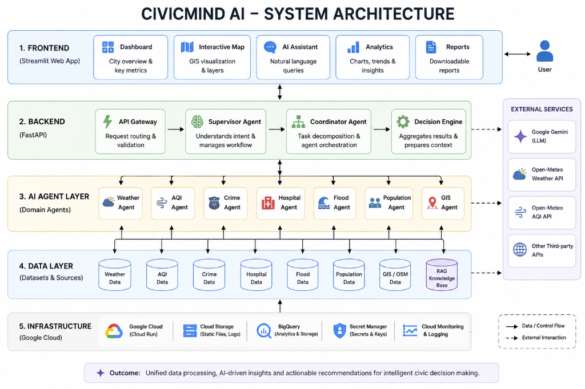
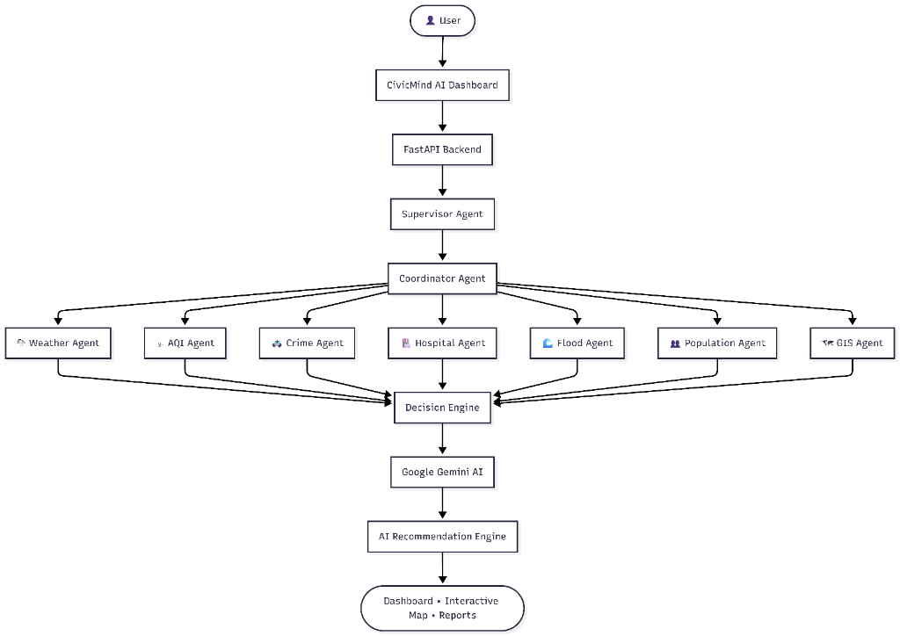

# 🌆 CivicMind AI

<p align="center">


# Enterprise Smart City Decision Intelligence Platform

### Multi-Agent AI • GIS Intelligence • Decision Support • Disaster Analytics

</p>

---

# 📖 Overview

CivicMind AI is an enterprise-grade Smart City Decision Intelligence Platform designed to assist city administrators, emergency responders, disaster management teams, and urban planners with real-time insights, AI-powered recommendations, and geospatial analytics.

The platform combines multiple heterogeneous datasets with AI reasoning to generate actionable intelligence for public safety, disaster preparedness, healthcare accessibility, environmental monitoring, and infrastructure planning.

Unlike conventional dashboards, CivicMind AI follows a **Multi-Agent Architecture**, where specialized AI agents collaborate to analyze diverse data sources before generating a final decision.

---

# ✨ Key Features

- 🤖 Multi-Agent Decision Intelligence
- 🌦 Live Weather Intelligence
- 🌫 Live AQI Monitoring
- 🗺 GIS-powered Interactive Maps
- 🏥 Hospital Accessibility Analysis
- 🌊 Flood Risk Assessment
- 🚓 Crime Pattern Analytics
- 👥 Population Density Analysis
- 📄 Retrieval-Augmented Generation (RAG)
- 📊 Executive Analytics Dashboard
- 📍 Smart City Intelligence
- 📑 Automated Reports
- 📱 Responsive Web Interface
- ⚡ Enterprise UI

---

# 🏗 System Architecture

The high-level system architecture of CivicMind AI is detailed below, highlighting the unified layers from frontend Streamlit views, through the FastAPI coordinator and domain agent orchestration, down to the regional databases and GCP infrastructure.

<p align="center">
  
</p>

---

# 🔄 Process Workflow

Below is the dynamic workflow flowchart demonstrating how a user's operational request flows through the Multi-Agent orchestrator, gets mapped to parallel domain-expert agents, and is synthesized via Gemini 2.5 Flash and retrieval models to output executive plans.

<p align="center">
  
</p>

---

# 🧠 Multi-Agent System

The platform includes specialized AI agents:

| Agent | Responsibility |
|---------|---------------|
| Supervisor Agent | Task Routing |
| Coordinator Agent | Parallel Execution |
| Weather Agent | Weather Intelligence |
| AQI Agent | Air Quality |
| Flood Agent | Flood Analytics |
| Crime Agent | Crime Intelligence |
| Hospital Agent | Healthcare Analysis |
| Population Agent | Population Insights |
| GIS Agent | Spatial Intelligence |
| Decision Agent | Final Recommendations |

---

# 🗺 GIS Capabilities

- OpenStreetMap Integration
- Dynamic State-Level Analysis
- Hospital Layer
- Flood Layer
- Crime Layer
- Population Layer
- Weather Layer
- AQI Layer
- Interactive Tooltips
- Clustered Markers
- Spatial Intelligence

---

# 📊 Dashboard Modules

- Dashboard
- Analytics
- City Intelligence
- Forecast
- AI Assistant
- Reports
- Settings

---

# 📁 Project Structure

```text
CivicMind-AI
│
├── assets/
├── backend/
│   ├── agents/
│   ├── services/
│   ├── rag/
│   ├── routers/
│   ├── data_sources/
│   └── main.py
│
├── frontend/
│   ├── components/
│   ├── pages/
│   ├── styles/
│   └── app.py
│
├── datasets/
├── config/
├── tests/
├── requirements.txt
└── README.md
```

---

# 🗃 Datasets

The project integrates real-world datasets including:

- Hospital Directory
- Crime Dataset
- Flood Events
- Catchment Characteristics
- IMD Rainfall
- Population Density
- OpenStreetMap
- Administrative Boundaries

Large GIS files are excluded from GitHub due to repository size limitations.

---

# ⚙ Technology Stack

### Backend

- FastAPI
- Python
- AsyncIO
- Pandas
- GeoPandas
- Rasterio

### AI

- Gemini
- FAISS
- RAG
- Multi-Agent Architecture

### GIS

- Folium
- OpenStreetMap
- GeoJSON
- Raster Layers

### Frontend

- Streamlit
- Plotly
- HTML/CSS
- JavaScript

---

# 🚀 Installation

Clone repository

```bash
git clone https://github.com/Harshithreddy-ux/CivicMind-AI.git

cd CivicMind-AI
```

Install dependencies

```bash
pip install -r requirements.txt
```

Configure environment

```env
GEMINI_API_KEY=YOUR_KEY
```

Start Backend

```bash
uvicorn backend.main:app --reload
```

Start Frontend

```bash
streamlit run frontend/app.py
```

---

# 📸 Screenshots

> Add screenshots here

- Dashboard
- Analytics
- Map
- AI Assistant
- Reports

---

# 🔮 Future Roadmap

- IoT Sensor Integration
- CCTV Analytics
- Satellite Imagery
- Predictive Flood Simulation
- Traffic Prediction
- Mobile Application
- Real-time WebSocket Updates
- Cloud Deployment
- Kubernetes Support

---

# 🤝 Contributing

Pull requests are welcome.

For major changes, please open an issue first to discuss proposed improvements.

---

# 📜 License

MIT License

---

# 👨‍💻 Author

**P. Harshith Reddy**

- [GitHub](https://github.com/Harshithreddy-ux)
- [LinkedIn](https://www.linkedin.com/in/p-harshith-reddy-679141333)

---

# ⭐ Support

If you found this project useful,

⭐ Star the repository

🍴 Fork the repository

🤝 Contribute to CivicMind AI

---

<p align="center">

Made with ❤️ using AI, GIS and Smart City Intelligence

</p>