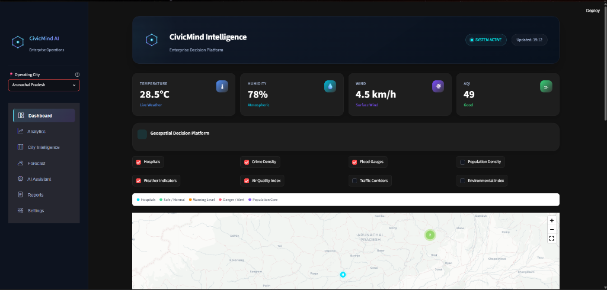
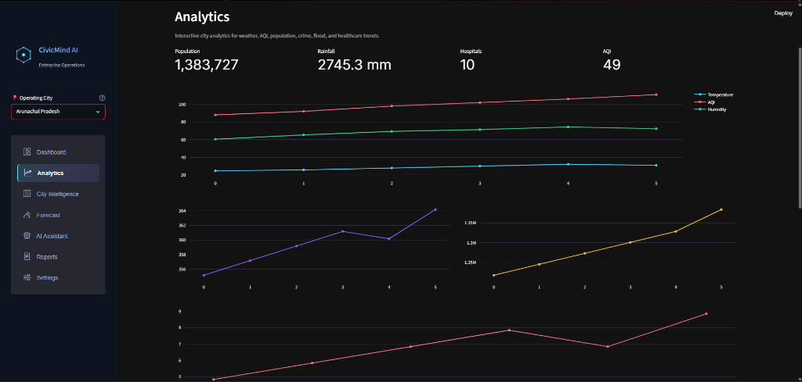
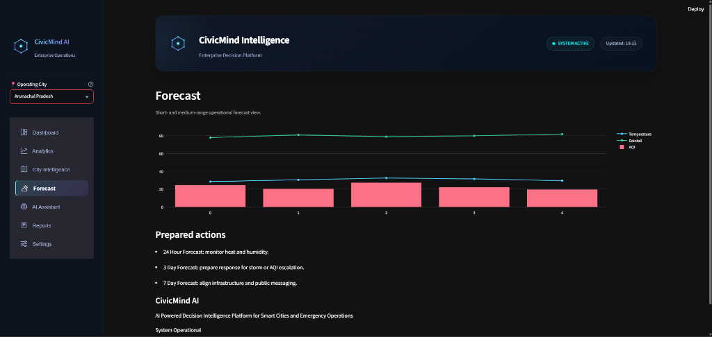
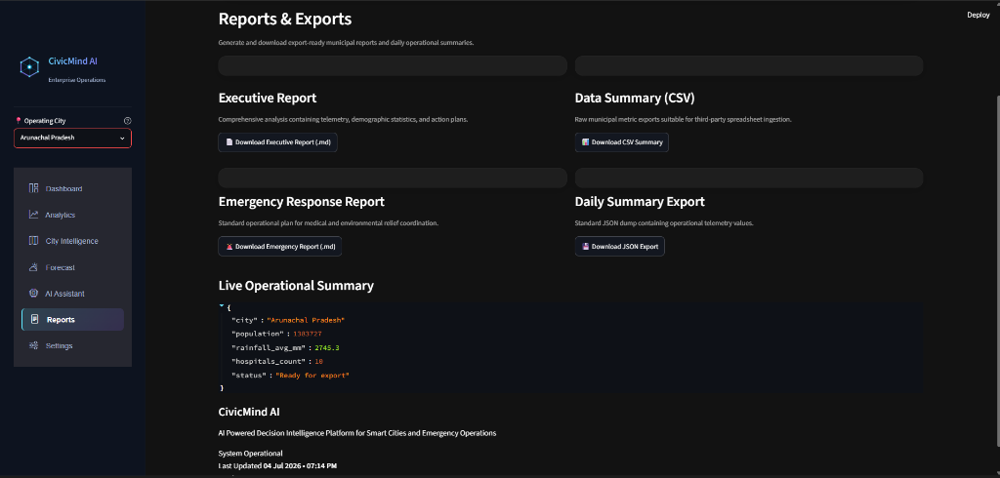
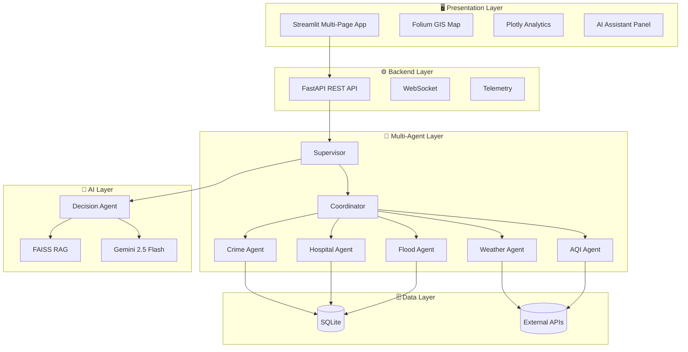
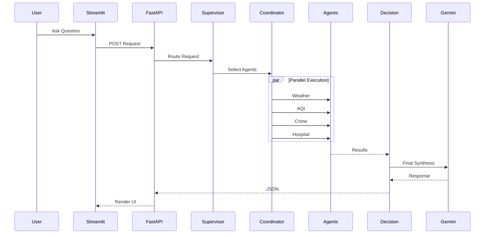
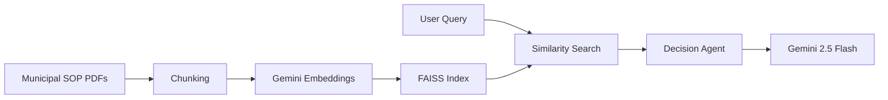
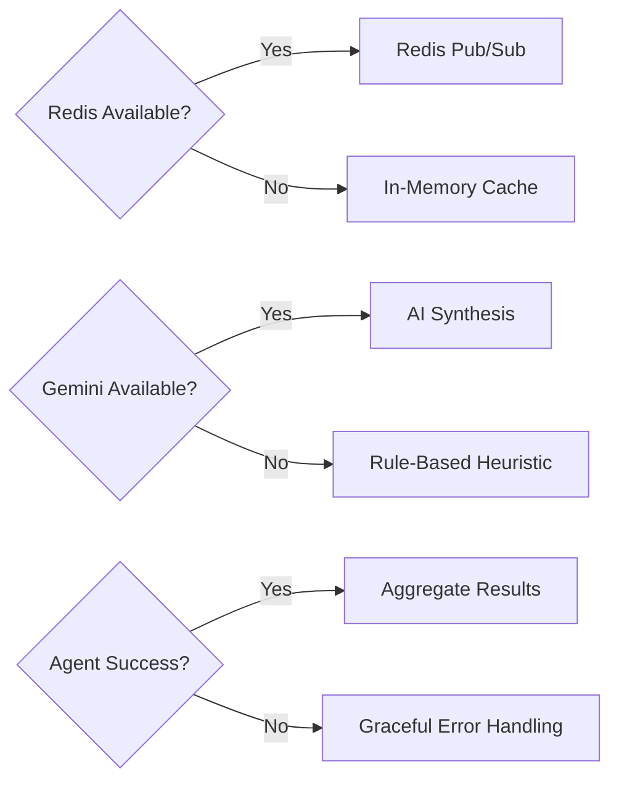

<div align="center">


# CivicMind AI

### Smart City Decision Intelligence Platform

*Multi-Agent AI · Real-Time GIS · Disaster Analytics · Urban Decision Support*

---

[](https://python.org)
[](https://streamlit.io)
[](https://fastapi.tiangolo.com)
[](https://sqlite.org)
[](https://ai.google.dev)
[](LICENSE)
[](https://github.com/Harshithreddy-ux/CivicMind-AI/commits/main)
[](https://github.com/Harshithreddy-ux/CivicMind-AI/stargazers)
[](https://github.com/Harshithreddy-ux/CivicMind-AI/network/members)
[](https://github.com/Harshithreddy-ux/CivicMind-AI/issues)

**[Live Demo](https://civicmind-x8zrh8o23aahmfrymvd52j.streamlit.app) · [Report Bug](https://github.com/Harshithreddy-ux/CivicMind-AI/issues) · [Request Feature](https://github.com/Harshithreddy-ux/CivicMind-AI/issues)**

</div>

---

## What is CivicMind AI?

CivicMind AI is a production-oriented **Smart City Decision Intelligence Platform** designed for city administrators, emergency responders, and urban planners to make faster, better-informed decisions using real-time data.

Instead of a conventional monitoring dashboard, CivicMind AI uses a **Multi-Agent AI Architecture** — specialized Gemini-powered agents work in parallel to analyze weather, air quality, crime patterns, hospital capacity, and flood risk, before synthesizing a final actionable recommendation grounded against municipal Standard Operating Procedures.

> **Built for Hack2Skill · Deployed on Streamlit Community Cloud · Open for contributions.**

---

## ✨ Key Features

| Feature | Description |
|---|---|
| 🤖 **Multi-Agent AI** | Parallel domain agents (Weather, AQI, Crime, Hospital, Flood) orchestrated by a Supervisor agent |
| 🌦 **Real-Time Weather & AQI** | Live telemetry via Open-Meteo & WAQI APIs using synchronous HTTPX for Streamlit Cloud compatibility |
| 🗺 **GIS City Intelligence** | Folium maps with clustered hospital markers, flood gauge overlays, crime heatmaps, and AQI stations |
| 📊 **Analytics Dashboard** | Plotly-powered historical charts with CSV/PNG export |
| 🔮 **7-Day Forecast** | Temperature, humidity, and AQI trend projections from Open-Meteo forecast models |
| 📋 **Municipal Reports** | One-click export in Markdown, CSV, and JSON formats |
| 🧠 **RAG Decision Engine** | Retrieval-Augmented Generation over municipal SOP guidelines using FAISS vector search |
| 🗄 **Indexed Data Layer** | 32,000+ hospital records in an indexed SQLite database |
| 🔒 **Graceful Fallbacks** | Rule-based heuristic engine activates when external APIs or AI services are unavailable |

---

## 📸 Screenshots

<details>
<summary><b>Click to expand screenshots</b></summary>

### 🏠 Home — Landing Page


Animated hero section with live dataset metrics, technology showcase, and architecture overview.

### 📊 Operations Dashboard



Live weather cards (temperature, humidity, wind, AQI), GIS map, risk score gauge, and city status panel.

### 🗺 City Intelligence — GIS Map


Interactive Folium map with hospital clusters, flood risk overlays, crime heatmaps, and clickable marker tooltips.

### 📈 Historical Analytics



Historical trend charts for crime density, population, rainfall, and temperature with filter controls.

### 🔮 7-Day Forecast



7-day multi-metric temperature envelope and precipitation projections rendered as animated Plotly charts.

### 🤖 AI Assistant


Gemini 2.5 Flash-powered decision interface with per-agent progress display, structured risk report, and source attribution.

### 📋 Municipal Reports



One-click downloadable executive reports in Markdown, CSV, and JSON formats with base64-encoded download buttons.

</details>

---

## 🏗 System Architecture


```mermaid
graph TB
    subgraph L1["🖥️ Presentation Layer"]
        UI[Streamlit Multi-Page App]
        Map[Folium GIS Map]
        Charts[Plotly Analytics]
        Assistant[AI Assistant Panel]
    end

    subgraph L2["⚙️ Backend Layer"]
        API[FastAPI REST API]
        WS[WebSocket]
        Ingest[Telemetry]
    end

    subgraph L3["🤖 Multi-Agent Layer"]
        Supervisor[Supervisor]
        Coordinator[Coordinator]
        Weather[Weather Agent]
        AQI[AQI Agent]
        Crime[Crime Agent]
        Hospital[Hospital Agent]
        Flood[Flood Agent]
    end

    subgraph L4["🧠 AI Layer"]
        Decision[Decision Agent]
        RAG[FAISS RAG]
        Gemini[Gemini 2.5 Flash]
    end

    subgraph L5["🗄️ Data Layer"]
        SQLite[(SQLite)]
        APIs[(External APIs)]
    end

    UI --> API
    API --> Supervisor
    Supervisor --> Coordinator
    Coordinator --> Weather
    Coordinator --> AQI
    Coordinator --> Crime
    Coordinator --> Hospital
    Coordinator --> Flood
    Supervisor --> Decision
    Decision --> RAG
    Decision --> Gemini
    Weather --> APIs
    AQI --> APIs
    Crime --> SQLite
    Hospital --> SQLite
    Flood --> SQLite
```

---

## 🔄 Request Flow


```mermaid
sequenceDiagram
    participant User
    participant Streamlit
    participant FastAPI
    participant Supervisor
    participant Coordinator
    participant Agents
    participant Decision
    participant Gemini

    User->>Streamlit: Ask Question
    Streamlit->>FastAPI: POST Request
    FastAPI->>Supervisor: Route Request
    Supervisor->>Coordinator: Select Agents

    par Parallel Execution
        Coordinator->>Agents: Weather
        Coordinator->>Agents: AQI
        Coordinator->>Agents: Crime
        Coordinator->>Agents: Hospital
    end

    Agents-->>Decision: Results
    Decision->>Gemini: Final Synthesis
    Gemini-->>Decision: Response
    Decision-->>FastAPI: JSON
    FastAPI-->>Streamlit: Render UI
```

---

## 🧠 RAG Pipeline


```mermaid
flowchart LR
    PDF[Municipal SOP PDFs]
    Chunk[Chunking]
    Embed[Gemini Embeddings]
    FAISS[FAISS Index]
    Query[User Query]
    Retrieve[Similarity Search]
    Decision[Decision Agent]
    Gemini[Gemini 2.5 Flash]

    PDF --> Chunk
    Chunk --> Embed
    Embed --> FAISS
    Query --> Retrieve
    FAISS --> Retrieve
    Retrieve --> Decision
    Decision --> Gemini
```

---

## 🛡 Reliability & Fallback Design


```mermaid
flowchart LR
    Redis{Redis Available?}
    Gemini{Gemini Available?}
    Agent{Agent Success?}

    Redis -->|Yes| PubSub[Redis Pub/Sub]
    Redis -->|No| Memory[In-Memory Cache]

    Gemini -->|Yes| AI[AI Synthesis]
    Gemini -->|No| Offline[Rule-Based Heuristic]

    Agent -->|Yes| Aggregate[Aggregate Results]
    Agent -->|No| Error[Graceful Error Handling]
```

---

## 🧑‍💻 Agent System

| Agent | Domain | Data Sources |
|---|---|---|
| **Supervisor** | Task routing & intent classification | All domain agents |
| **Coordinator** | Parallel async execution orchestration | All domain agents |
| **Weather Agent** | Temperature, wind, humidity, precipitation | Open-Meteo API |
| **AQI Agent** | Air Quality Index, PM2.5, PM10 | Open-Meteo Air Quality API |
| **Flood Agent** | Flood gauges, rainfall, catchment data | IndoFloods Dataset, IMD Subdivision Rainfall |
| **Crime Agent** | Crime density, incident spatial mapping | Crime Dataset India |
| **Hospital Agent** | Healthcare facilities & accessibility | SQLite Hospital Directory (32,000+ records) |
| **Decision Agent** | Final synthesis & actionable recommendations | Gemini 2.5 Flash + FAISS RAG |

---

## 🛠 Technology Stack

| Layer | Technology |
|---|---|
| **Frontend** | Streamlit 1.30+, Plotly, Folium, `streamlit-folium`, Vanilla CSS |
| **Backend** | FastAPI, Uvicorn, Pydantic v2 |
| **AI & ML** | Google Gemini 2.5 Flash (`google-genai` SDK), FAISS |
| **HTTP Client** | HTTPX (synchronous — Streamlit Cloud compatible) |
| **Database** | SQLite 3 (indexed, 32,000+ records) |
| **Mapping** | Folium, OpenStreetMap Positron tiles |
| **Data Science** | Pandas, NumPy |
| **Testing** | Pytest, pytest-asyncio |
| **Config** | python-dotenv |
| **CI/CD** | GitHub Actions |
| **Deployment** | Streamlit Community Cloud |

---

## 🚀 Quick Start

### Prerequisites

- Python 3.10 or higher
- A [Google AI Studio](https://aistudio.google.com) API key (free tier available)

### 1. Clone

```bash
git clone https://github.com/Harshithreddy-ux/CivicMind-AI.git
cd CivicMind-AI
```

### 2. Configure environment

```bash
cp .env.example .env
# Edit .env and set GEMINI_API_KEY=your_key_here
```

### 3. Install dependencies

```bash
pip install -r requirements.txt
```

### 4. Run

**Option A — Full stack (FastAPI backend + Streamlit frontend)**

```bash
# Terminal 1
uvicorn backend.main:app --reload --port 8000

# Terminal 2
streamlit run frontend/app.py
```

**Option B — Frontend only (self-contained, no backend required)**

```bash
streamlit run frontend/app.py
```

> The frontend automatically uses direct in-process service calls when the backend is unreachable. Weather and AQI data are fetched directly via synchronous HTTPX calls.

---

## ⚙️ Environment Variables

| Variable | Required | Default | Description |
|---|---|---|---|
| `GEMINI_API_KEY` | ✅ Yes | — | Google Gemini API key from AI Studio |
| `GEMINI_MODEL` | No | `gemini-2.5-flash` | Gemini model variant |
| `BACKEND_URL` | No | `http://127.0.0.1:8000` | FastAPI backend base URL |
| `WAQI_TOKEN` | No | — | WAQI API token for extended AQI data (optional) |
| `REDIS_URL` | No | — | Redis connection URL for optional caching |
| `LOG_LEVEL` | No | `INFO` | Logging verbosity level |

---

## 🌐 Deployment

### Streamlit Community Cloud (Recommended)

1. Fork this repository
2. Go to [share.streamlit.io](https://share.streamlit.io)
3. Connect your forked repository; set **Main file path** to `frontend/app.py`
4. Add `GEMINI_API_KEY` under **Settings → Secrets**
5. Click **Deploy** — dependencies install automatically on first run

### Local (Docker-free)

```bash
# Backend (optional)
uvicorn backend.main:app --host 0.0.0.0 --port 8000 --workers 2

# Frontend
streamlit run frontend/app.py --server.port 8501 --server.address 0.0.0.0
```

---

## 🧪 Testing

```bash
pytest tests/ -v
```

Current test coverage includes AI service fallback logic, dataset loading, city configuration validation, and population/rainfall data service correctness.

---

## 📁 Project Structure

```
CivicMind-AI/
│
├── .github/
│   ├── workflows/
│   │   └── ci.yml                  # GitHub Actions CI pipeline
│   ├── ISSUE_TEMPLATE/
│   │   ├── bug_report.md
│   │   └── feature_request.md
│   └── pull_request_template.md
│
├── backend/
│   ├── agents/                     # Domain AI agents (coordinator, flood, etc.)
│   ├── data_sources/               # API clients and dataset loaders
│   ├── rag/                        # RAG pipeline (FAISS + Gemini embeddings)
│   ├── schemas/                    # Pydantic request/response models
│   ├── services/                   # AI, weather, AQI, live data services
│   └── main.py                     # FastAPI application entry point
│
├── frontend/
│   ├── components/                 # Reusable UI components (cards, map, AI panel)
│   ├── pages/                      # Page modules (Dashboard, Analytics, etc.)
│   ├── styles/                     # CSS design system (style.css)
│   ├── utils/                      # Dataset service helpers
│   └── app.py                      # Streamlit application entry point
│
├── config/                         # City coordinate and metadata definitions
├── database/                       # SQLite schema and query helpers
├── datasets/                       # CSV datasets and municipal SOP guidelines
├── docs/                           # Additional project documentation
├── tests/                          # Pytest test suite
├── assets/                         # Logo and visual assets
│
├── .streamlit/config.toml          # Streamlit theme and server configuration
├── .env.example                    # Environment variable template
├── requirements.txt                # Python dependencies
├── CONTRIBUTING.md                 # Contribution guidelines
├── CODE_OF_CONDUCT.md              # Community standards
├── SECURITY.md                     # Security disclosure policy
├── CHANGELOG.md                    # Version history
└── README.md                       # This file
```

---

## 🗺 Roadmap

- [x] Multi-agent AI architecture with Supervisor/Coordinator orchestration
- [x] Real-time weather and AQI monitoring (Open-Meteo, synchronous HTTPX)
- [x] GIS hospital clusters, flood gauge overlays, and crime heatmaps
- [x] RAG decision engine with FAISS vector search over SOP guidelines
- [x] Indexed SQLite data layer (32,000+ hospital records)
- [x] Premium dark-mode UI with light/dark switching
- [x] Municipal report export (Markdown, CSV, JSON)
- [x] Self-contained Streamlit Community Cloud deployment
- [x] GitHub Actions CI pipeline with pytest
- [ ] WebSocket real-time sensor data streaming
- [ ] IoT sensor integration layer
- [ ] Mobile application (Flutter)
- [ ] Satellite imagery overlay (ISRO / Bhoonidhi)
- [ ] Predictive flood simulation engine
- [ ] Kubernetes deployment configuration
- [ ] User authentication and organisation workspaces

---

## 🤝 Contributing

Contributions are welcome. Please read [CONTRIBUTING.md](CONTRIBUTING.md) before opening a pull request.

1. Fork the repository
2. Create a feature branch: `git checkout -b feature/your-feature`
3. Commit using Conventional Commits: `git commit -m "feat: add your feature"`
4. Push your branch: `git push origin feature/your-feature`
5. Open a Pull Request against `main`

Please follow the [Code of Conduct](CODE_OF_CONDUCT.md) in all interactions.

---

## 🔒 Security

Found a vulnerability? Please follow the responsible disclosure process described in [SECURITY.md](SECURITY.md). Do not open public GitHub issues for security concerns.

---

## 📜 License

Distributed under the **MIT License**. See [LICENSE](LICENSE) for full details.

---

## 👤 Author

**P. Harshith Reddy**

[](https://github.com/Harshithreddy-ux)
[](https://www.linkedin.com/in/p-harshith-reddy-679141333)

---

<div align="center">

⭐ **Star this repository** if CivicMind AI helped you or inspired your work!

*Made with ❤️ for Smart Cities, Open Data, and AI-powered governance*

</div>